## Unzipping Immutability

This page contains the materials for my talk “Unzipping Immutability”.
Here are some past and future presentations:

* [LX Scala 2016](http://www.lxscala.com/schedule/#session-2) ([video](https://vimeo.com/162214356)).
* [Pixels Camp 2016](https://github.com/PixelsCamp/talks/blob/master/unzipping-immutability_nick-stanchenko.md).
* [Scala By The Bay 2016](http://sched.co/7iTv).

You can use this page in two ways:

* as a reference/refresher on the concepts covered in the talk;
* as an interactive playground where you can try the same commands I presented.

Here is an overview:

* [Immutable data structures (wip)](#immutable-data-structures)
* [Lenses](#lenses)
* [Zippers](#zippers)
* [Useful resources](#useful-resources)

Throughout this page we will assume the following
declarations (each section might add its own):

```scala
import reftree._
import reftree.demo.Data._, reftree.demo.Generators._
import scala.collection.immutable._
import java.nio.file.Paths

val diagram = Diagram(
  defaultOptions = Diagram.Options(density = 100),
  defaultDirectory = Paths.get("images")
)
```

To start an interactive session, just run

```
$ sbt demo
@ render(List(1, 2, 3))
```

and open `diagram.png` in your favorite image viewer (hopefully one that
reloads images automatically on file change). You will also need to have
[GraphViz](http://www.graphviz.org/) installed. *The interactive session
already has all the necessary imports in scope.*

### Immutable data structures

This section is not ready yet, but in the meantime you can find
a few interesting visualizations on the [main page](https://github.com/stanch/reftree).


### Lenses

Updating immutable data structures can be tricky.
For case classes Scala gives us the `copy` method:

```scala
case class Employee(
  name: String,
  salary: Long
)
```

```scala
scala> val employee = employees.sample.get
employee: reftree.demo.Data.Employee = Employee(Jamar,1795)

scala> val raisedEmployee = employee.copy(salary = employee.salary + 10)
raisedEmployee: reftree.demo.Data.Employee = Employee(Jamar,1805)
```

However once composition comes into play, the resulting nested immutable data structures
would require a lot of `copy` calls:

```scala
case class Employee(
  name: String,
  salary: Long
)

case class Startup(
  name: String,
  ceo: Employee,
  team: List[Employee]
)
```

```scala
scala> val startup = startups.sample.get
startup: reftree.demo.Data.Startup = Startup(Lehner-King,Employee(Samir,4535),List(Employee(Ervin,1310), Employee(Larry,1559), Employee(Violet,1662), Employee(Lilla,1222)))

scala> val raisedCeo = startup.copy(
     |   ceo = startup.ceo.copy(
     |     salary = startup.ceo.salary + 10
     |   )
     | )
raisedCeo: reftree.demo.Data.Startup = Startup(Lehner-King,Employee(Samir,4545),List(Employee(Ervin,1310), Employee(Larry,1559), Employee(Violet,1662), Employee(Lilla,1222)))
```

```scala
// extra declarations for this section
import reftree.ToRefTree.Simple.list
import reftree.contrib.LensInstances._

val diagram = Diagram(
  defaultOptions = Diagram.Options(density = 100),
  defaultDirectory = Paths.get("images", "lenses")
)
```

```scala
diagram.render("startup")(startup, raisedCeo)
```

<p align="center"></p>

Ouch!

A common solution to this problem is a “lens”.
In the simplest case a lens is a pair of functions to get and set a value of type `B` inside a value of type `A`.
It’s called a lens because it focuses on some part of the data and allows to update it.
For example, here is a lens that focuses on an employee’s salary
(using the excellent [Monocle library](https://github.com/julien-truffaut/Monocle)):

```scala
scala> import monocle.macros.GenLens
import monocle.macros.GenLens

scala> val salaryLens = GenLens[Employee](_.salary)
warning: there was one feature warning; re-run with -feature for details
salaryLens: monocle.Lens[reftree.demo.Data.Employee,Long] = $anon$1@38a6ff15

scala> salaryLens.get(startup.ceo)
res4: Long = 4535

scala> salaryLens.modify(s => s + 10)(startup.ceo)
res5: reftree.demo.Data.Employee = Employee(Samir,4545)
```

```scala
diagram.render("salaryLens")(salaryLens → startup.ceo)
```

<p align="center">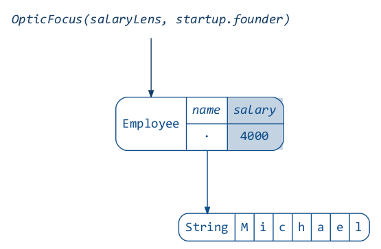</p>

We can also define a lens that focuses on the startup’s CEO:

```scala
scala> val ceoLens = GenLens[Startup](_.ceo)
warning: there was one feature warning; re-run with -feature for details
ceoLens: monocle.Lens[reftree.demo.Data.Startup,reftree.demo.Data.Employee] = $anon$1@3c4ea118

scala> ceoLens.get(startup)
res7: reftree.demo.Data.Employee = Employee(Samir,4535)
```

```scala
diagram.render("ceoLens")(ceoLens → startup)
```

<p align="center">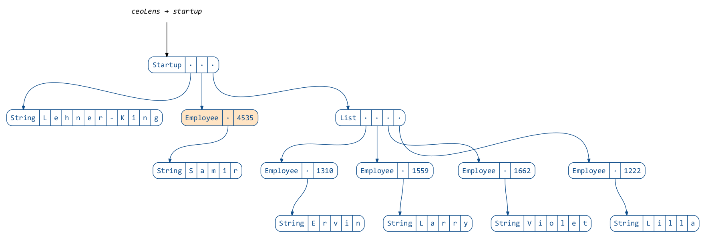</p>

It’s not apparent yet how this would help, but the trick is that lenses can be composed:

```scala
scala> val ceoSalaryLens = ceoLens composeLens salaryLens
ceoSalaryLens: monocle.PLens[reftree.demo.Data.Startup,reftree.demo.Data.Startup,Long,Long] = monocle.PLens$$anon$1@3bb9d624

scala> ceoSalaryLens.get(startup)
res9: Long = 4535

scala> ceoSalaryLens.modify(s => s + 10)(startup)
res10: reftree.demo.Data.Startup = Startup(Lehner-King,Employee(Samir,4545),List(Employee(Ervin,1310), Employee(Larry,1559), Employee(Violet,1662), Employee(Lilla,1222)))
```

```scala
diagram.render("ceoSalaryLens")(ceoSalaryLens → startup)
```

<p align="center">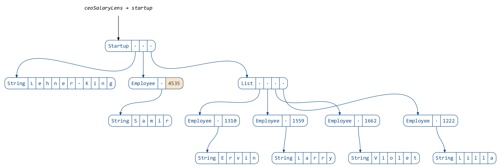</p>

One interesting thing is that lenses can focus on anything, not just direct attributes of the data.
Here is a lens that focuses on all vowels in a string:

```scala
diagram.render("vowelLens")(vowelLens)
```

<p align="center">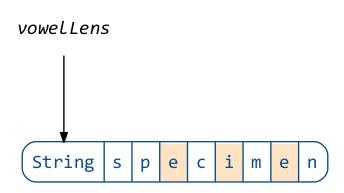</p>

We can use it to give our CEO a funny name:

```scala
scala> val employeeNameLens = GenLens[Employee](_.name)
warning: there was one feature warning; re-run with -feature for details
employeeNameLens: monocle.Lens[reftree.demo.Data.Employee,String] = $anon$1@1ee31d20

scala> val ceoVowelLens = ceoLens composeLens employeeNameLens composeTraversal vowelLens
ceoVowelLens: monocle.PTraversal[reftree.demo.Data.Startup,reftree.demo.Data.Startup,Char,Char] = monocle.PTraversal$$anon$2@40feb650

scala> ceoVowelLens.modify(v => v.toUpper)(startup)
res13: reftree.demo.Data.Startup = Startup(Lehner-King,Employee(SAmIr,4535),List(Employee(Ervin,1310), Employee(Larry,1559), Employee(Violet,1662), Employee(Lilla,1222)))
```

```scala
diagram.render("ceoVowelLens")(ceoVowelLens → startup)
```

<p align="center">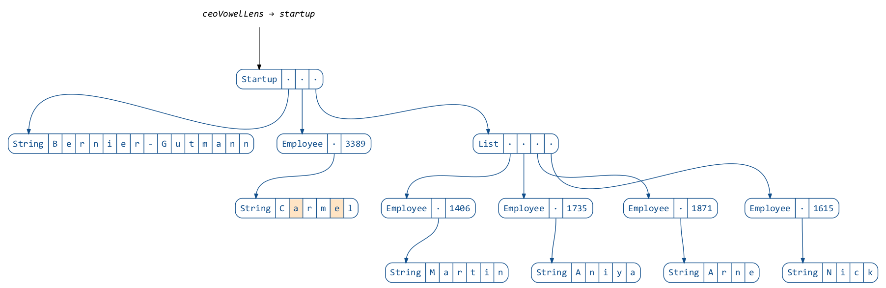</p>

So far we have replaced the `copy` boilerplate with a number of lens declarations.
However most of the time our goal is just to update data.

In Scala there is a great library called [quicklens](https://github.com/adamw/quicklens)
that allows to do exactly that, creating all the necessary lenses under the hood:

```scala
scala> import com.softwaremill.quicklens._
import com.softwaremill.quicklens._

scala> val raisedCeo = startup.modify(_.ceo.salary).using(s => s + 10)
raisedCeo: reftree.demo.Data.Startup = Startup(Lehner-King,Employee(Samir,4545),List(Employee(Ervin,1310), Employee(Larry,1559), Employee(Violet,1662), Employee(Lilla,1222)))
```

You might think this is approaching the syntax for updating mutable data,
but actually we have already surpassed it, since lenses are much more flexible:


```scala
scala> val raisedEveryone = startup.modifyAll(_.ceo.salary, _.team.each.salary).using(s => s + 10)
raisedEveryone: reftree.demo.Data.Startup = Startup(Lehner-King,Employee(Samir,4545),List(Employee(Ervin,1320), Employee(Larry,1569), Employee(Violet,1672), Employee(Lilla,1232)))
```


### Zippers

In our domain models we are often faced with recursive data structures.
Consider this example:

```scala
case class Employee(
  name: String,
  salary: Long
)

case class Hierarchy(
  employee: Employee,
  team: List[Hierarchy]
)

case class Company(
  name: String,
  hierarchy: Hierarchy
)
```

The `Hierarchy` class refers to itself.
Let’s grab a random company object and display its hierarchy as a tree:

```scala
// extra declarations for this section
import zipper._
import reftree.ToRefTree.Simple.option

val diagram = Diagram(
  defaultOptions = Diagram.Options(density = 100),
  defaultDirectory = Paths.get("images", "zippers")
)
```

```scala
val company = companies.sample.get
val hierarchy = company.hierarchy
```

```scala
diagram.render("company")(hierarchy)
```

<p align="center">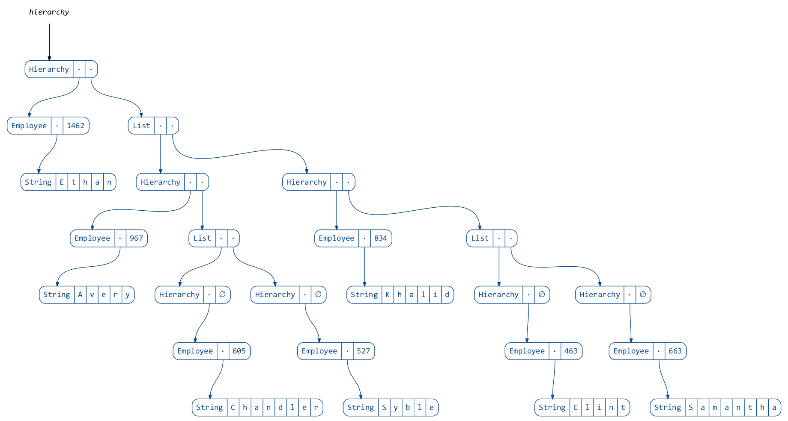</p>

What if we want to navigate through this tree and modify it along the way?
We can use [lenses](#lenses), but the recursive nature of the tree allows for a better solution.

This solution is called a “Zipper”, and was introduced by Gérard Huet in 1997.
It consists of a “cursor” pointing to a location anywhere in the tree — “current focus”.
The cursor can be moved freely with operations like `moveDownLeft`, `moveRight`, `moveUp`, etc.
Current focus can be updated, deleted, or new nodes can be inserted to its left or right.
Zippers are immutable, and every operation returns a new Zipper.
All the changes made to the tree can be committed, yielding a new modified version of the original tree.

Here is how we would insert a new employee into the hierarchy:

```scala
val newEmployee = Hierarchy(employees.sample.get, team = List.empty)
val updatedHierarchy = Zipper(hierarchy).moveDownRight.moveDownRight.insertRight(newEmployee).commit
```

```scala
diagram.render("updatedHierarchy")(hierarchy, updatedHierarchy)
```

<p align="center">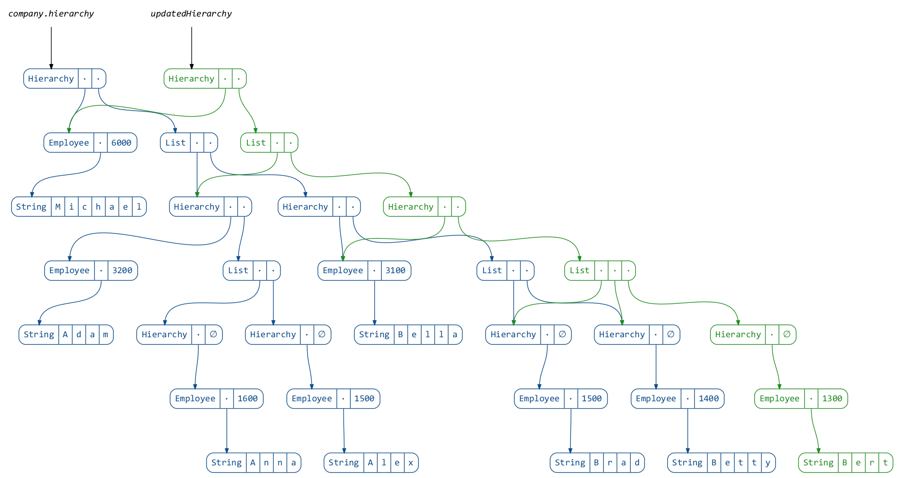</p>

My [zipper library](https://github.com/stanch/zipper#zipper--an-implementation-of-huets-zipper)
provides a few useful movements and operations.

Let’s consider a simpler recursive data structure:

```scala
case class Tree(x: Int, c: List[Tree] = List.empty)
```

and a simple tree:

```scala
val tree1 = Tree(
  1, List(
    Tree(2),
    Tree(3),
    Tree(4),
    Tree(5)
  )
)
```

```scala
diagram.render("tree1")(tree1)
```

<p align="center">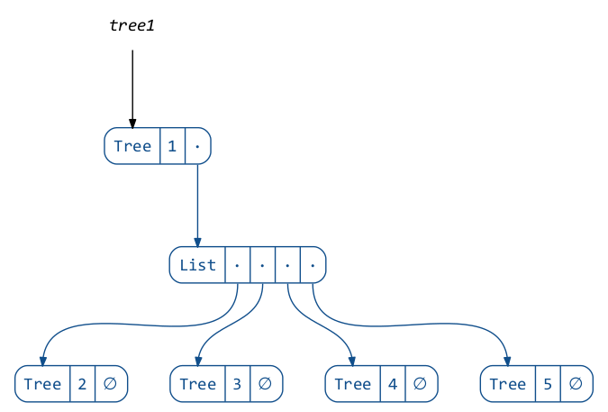</p>

When we wrap a Zipper around this tree, it does not look very interesting yet:

```scala
val zipper1 = Zipper(tree1)
```

```scala
diagram.render("zipper1")(tree1, zipper1)
```

<p align="center">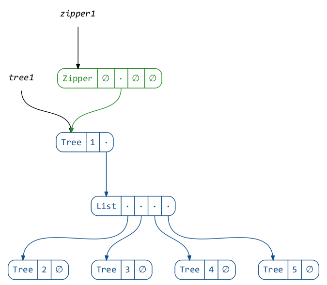</p>

We can see that it just points to the original tree and has some other empty fields.
More specifically, a Zipper consists of four pointers:

```scala
case class Zipper[A](
  left: List[A],           // left siblings of the focus
  focus: A,                // the current focus
  right: List[A],          // right siblings of the focus
  top: Option[Zipper[A]]   // the parent zipper
)
```

In this case the focus is the root of the tree, which has no siblings,
and the parent zipper does not exist, since we are at the top level.

One thing we can do right away is modify the focus:

```scala
val zipper2 = zipper1.update(focus ⇒ focus.copy(x = focus.x + 99))
```

```scala
diagram.render("zipper2")(tree1, zipper1, zipper2)
```

<p align="center">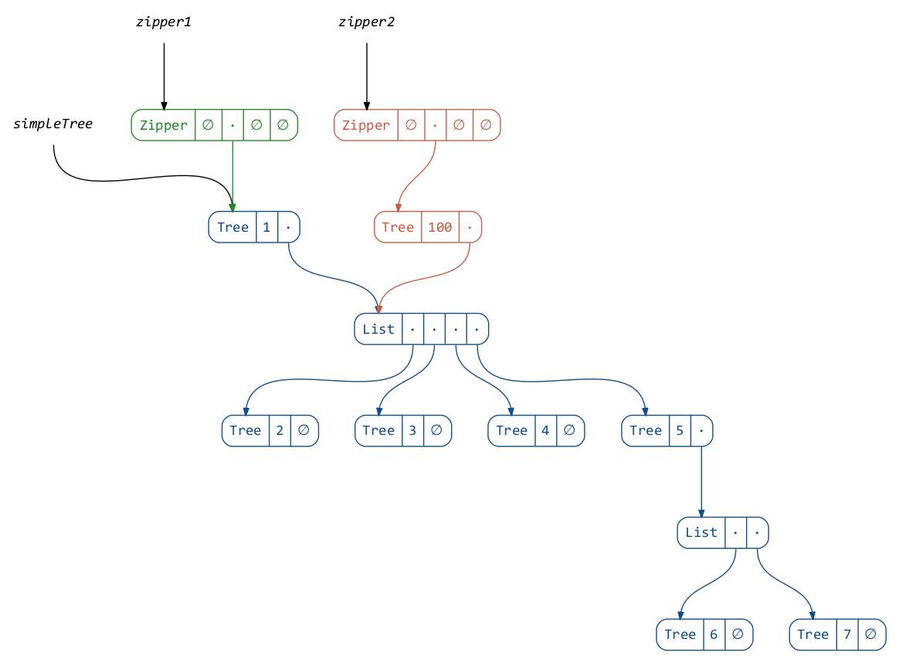</p>

We just created a new tree! To obtain it, we have to commit the changes:

```scala
val tree2 = zipper2.commit
```

```scala
diagram.render("tree2")(tree1, tree2)
```

<p align="center">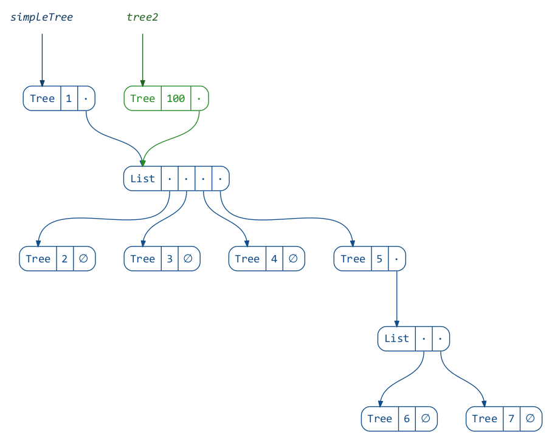</p>

If you were following closely,
you would notice that nothing spectacular happened yet:
we could’ve easily obtained the same result by modifying the tree directly:

```scala
val tree2b = tree1.copy(x = tree1.x + 99)

assert(tree2b == tree2)
```

The power of Zipper becomes apparent when we go one or more levels deep.
To move down the tree, we “unzip” it, separating the child nodes into
the focused node and its left and right siblings:

```scala
val zipper2 = zipper1.moveDownLeft
```

```scala
diagram.render("zipper1+2")(zipper1, zipper2)
```

<p align="center">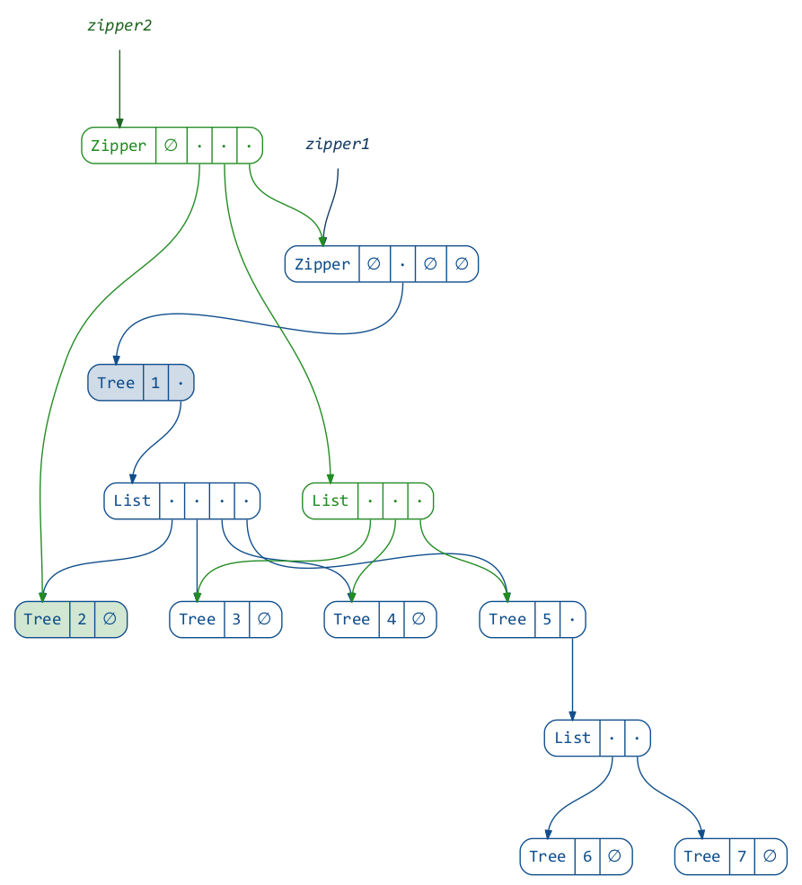</p>

The new Zipper links to the old one,
which will allow us to return to the root of the tree when we are done applying changes.
This link however prevents us from seeing the picture clearly.
Let’s elide the parent field:

```scala
import reftree.contrib.ZipperInstances.elideParent
```

```scala
diagram.render("zipper2b")(zipper2)
```

<p align="center">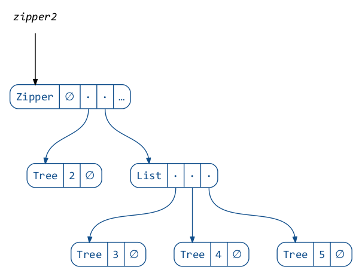</p>

Great! We have `2` in focus and `3, 4, 5` as right siblings. What happens if we move right a bit?

```scala
val zipper3 = zipper2.moveRightBy(2)
```

```scala
diagram.render("zipper3")(zipper3)
```

<p align="center">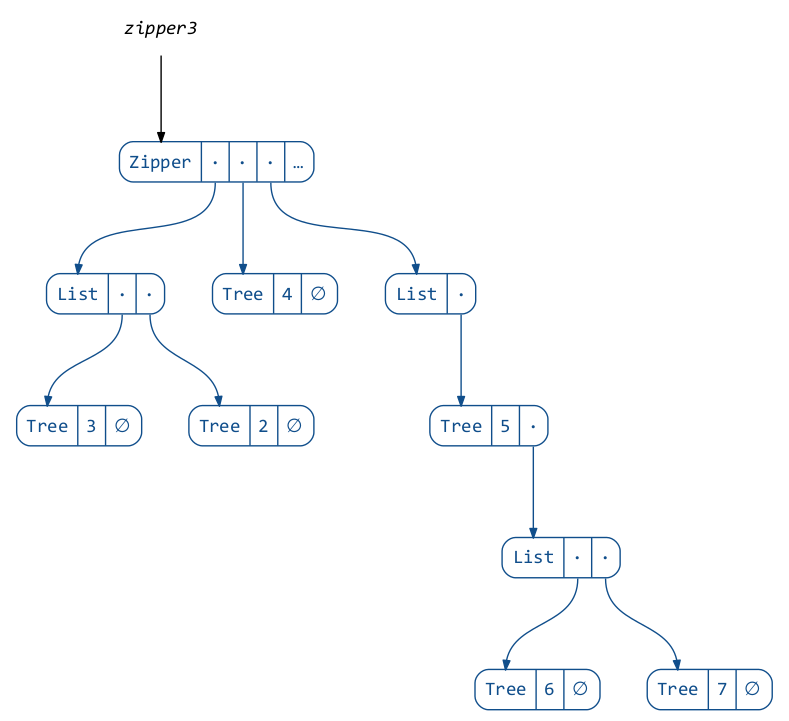</p>

This is interesting! Notice that the left siblings are “inverted”.
This allows to move left and right in constant time, because the sibling
adjacent to the focus is always at the head of the list.

This also allows us to insert new siblings easily:

```scala
val zipper4 = zipper3.insertLeft(Tree(34))
```

```scala
diagram.render("zipper4")(zipper4)
```

<p align="center">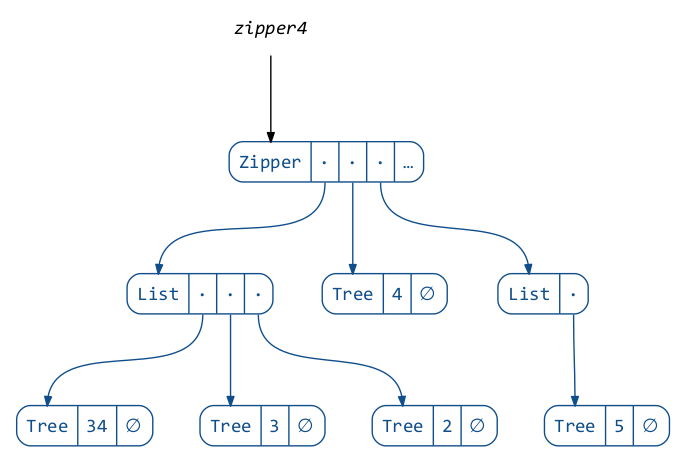</p>

And, as you might know, we can delete nodes and update the focus:

```scala
val zipper5 = zipper4.deleteAndMoveRight.set(Tree(45))
```

```scala
diagram.render("zipper5")(zipper5)
```

<p align="center">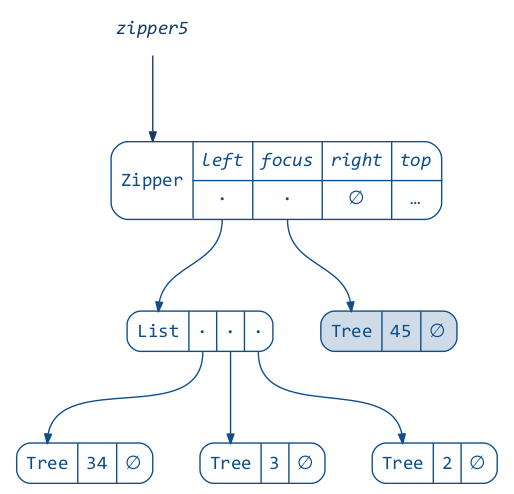</p>

Here is an animation of the focus moving between the sibling nodes:

```scala
diagram.renderAnimation("sideways", tweakOptions = _.copy(onionSkinLayers = 0))(
  Utils.iterate(zipper2)(
    _.moveRight, _.moveRight, _.moveRight,
    _.moveLeft, _.moveLeft, _.moveLeft
  )
)
```

<p align="center">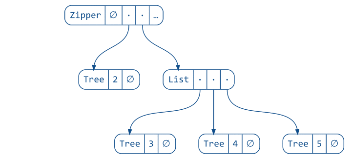</p>

Finally, when we move up, the siblings at the current level are “zipped”
together and their parent node is updated:

```scala
val zipper6 = zipper5.moveUp
```

```scala
diagram.render("zipper6")(zipper6)
```

<p align="center">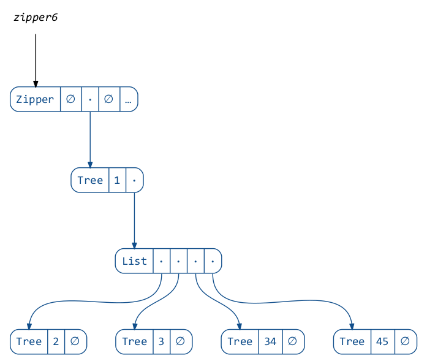</p>

You can probably guess by now that `.commit` is a shorthand for going
all the way up (applying all the changes) and returning the focus:

```scala
val tree3a = zipper5.moveUp.focus
val tree3b = zipper5.commit

assert(tree3a == tree3b)
```


### Useful resources

#### Books, papers and talks

* [Purely functional data structures](http://www.amazon.com/Purely-Functional-Structures-Chris-Okasaki/dp/0521663504) by Chris Okasaki,
  and/or [his PhD thesis](https://www.cs.cmu.edu/~rwh/theses/okasaki.pdf) — *the* introduction to immutable data structures
* [What’s new in purely functional data structures since Okasaki](http://cstheory.stackexchange.com/a/1550) — an excellent StackExchange answer
  with pointers for further reading
* [Extreme cleverness](https://www.youtube.com/watch?v=pNhBQJN44YQ) by Daniel Spiewak — a superb talk
  covering several immutable data structures (implemented [here](https://github.com/djspiewak/extreme-cleverness))
* [Finger Trees](http://www.cs.ox.ac.uk/ralf.hinze/publications/FingerTrees.pdf) and
  [1-2 Brother Trees](http://www.cs.ox.ac.uk/ralf.hinze/publications/Brother12.pdf) described by Hinze and Paterson
* [Huet’s original Zipper paper](https://www.st.cs.uni-saarland.de/edu/seminare/2005/advanced-fp/docs/huet-zipper.pdf) — a great short read
  introducing the Zipper
* [Weaving a web](http://dspace.library.uu.nl/bitstream/handle/1874/2532/2001-33.pdf) by Hinze and Jeuring —
  another interesting Zipper-like approach

#### Scala libraries

* [zipper](https://github.com/stanch/zipper) — my Zipper implementation
* [Monocle](https://github.com/julien-truffaut/Monocle) — an “optics” library
* [Quicklens](https://github.com/adamw/quicklens) — a simpler way to update nested case classes
* [FingerTree](https://github.com/Sciss/FingerTree) — an implementation of the Finger Tree data structure
