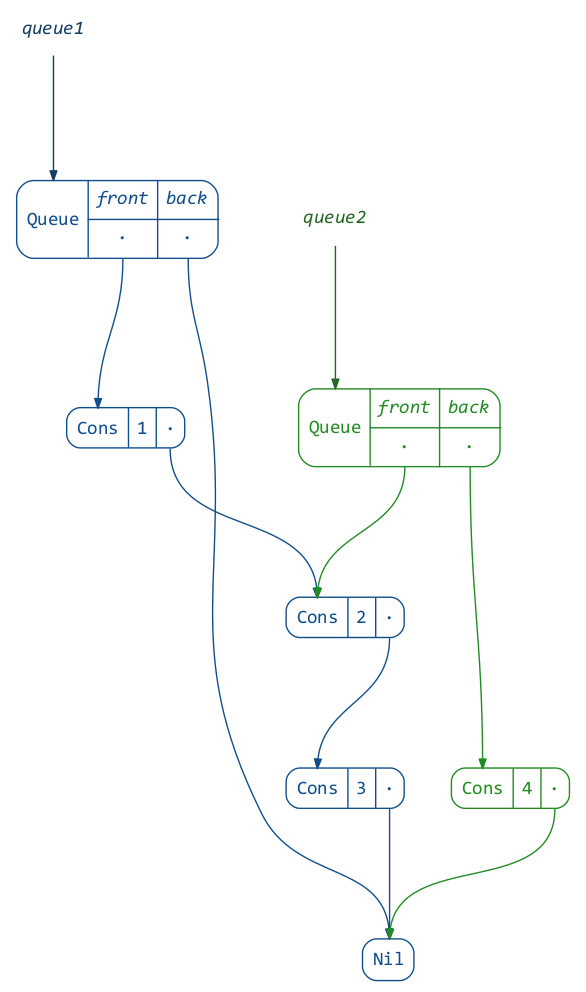
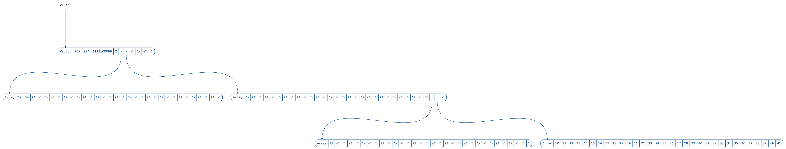
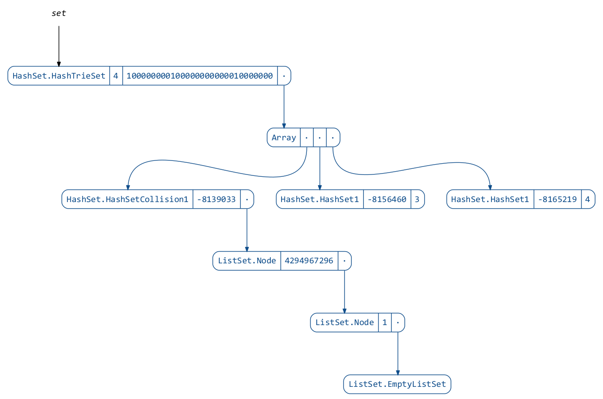
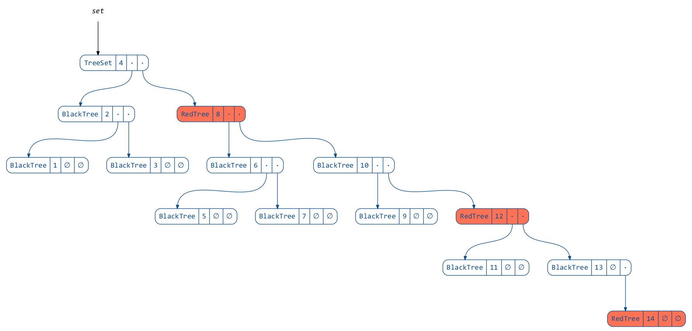
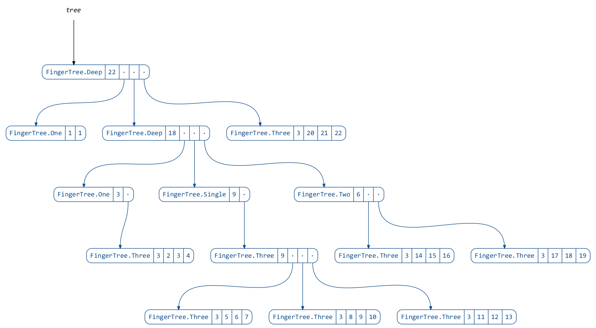
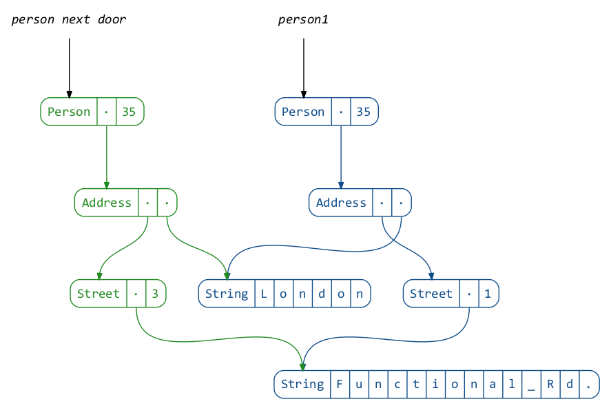
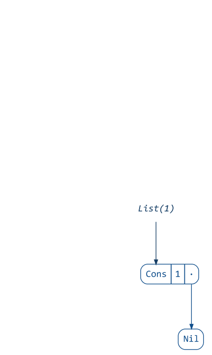
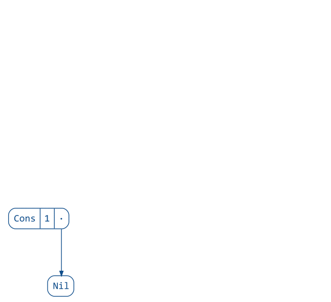

## reftree — automatic object tree diagrams for immutable data

[](https://gitter.im/stanch/reftree?utm_source=badge&utm_medium=badge&utm_campaign=pr-badge&utm_content=badge)

This project aims to provide visualizations for common functional data structures used in Scala.
The visualizations are generated automatically from code, which allows to use them in an interactive fashion.
To use this library you will need to have [GraphViz](http://www.graphviz.org/) installed (and have `dot` on your `PATH`).

For more examples see the [materials for my talk “Unzipping Immutability”](DEMO.md).

### Examples

The following examples will assume these declarations:
```scala
import scala.collection.immutable._
import java.nio.file.Paths
import reftree.Diagram

val diagram = Diagram(
  defaultOptions = Diagram.Options(density = 100),
  defaultDirectory = Paths.get("images", "data")
)
```

Since all the example code is actually run by [tut](https://github.com/tpolecat/tut),
you can find the resulting images in the `images` directory.

#### Lists

```scala
val list1 = List(1, 2, 3, 4, 5)
val list2 = List(-1, -2) ++ list1.drop(2)

diagram.render("lists")(list1, list2)
```

<p align="center"></p>

By default the trees will be labeled with the arguments passed to `render`
(using [sourcecode](https://github.com/lihaoyi/sourcecode)),
but you can provide the labels explicitly:

```scala
val list1 = List(1, 2, 3, 4, 5)
val list2 = List(-1, -2) ++ list1.drop(2)

diagram.render("lists2")(
  "positive" → list1,
  "negative" → list2
)
```

<p align="center"></p>

#### Queues

```scala
val queue1 = Queue(1, 2) :+ 3 :+ 4
val queue2 = (queue1 :+ 5).tail

diagram.render("queues", tweakOptions = _.copy(verticalSpacing = 1.2))(queue1, queue2)
```

<p align="center"></p>

To reduce visual noise from `Cons` and `Nil`, the visualization of lists can be simplified.
Note however that this option also hides structural sharing:

```scala
import reftree.ToRefTree.Simple.list

val queue1 = Queue(1, 2) :+ 3 :+ 4
val queue2 = (queue1 :+ 5).tail

diagram.render("queues2")(queue1, queue2)
```

<p align="center"></p>


#### Vectors

```scala
 val vector = 1 +: Vector(10 to 42: _*) :+ 50

 diagram.render("vector", tweakOptions = _.copy(verticalSpacing = 2))(vector)
```

<p align="center"></p>

#### HashSets

```scala
val set = HashSet(1L, 2L + 2L * Int.MaxValue, 3L, 4L)

diagram.render("hashset")(set)
```

<p align="center"></p>

#### TreeSets

```scala
val set = TreeSet(1 to 14: _*)

diagram.render("treeset", tweakOptions = _.copy(highlightColor = "coral1"))(set)
```

<p align="center"></p>

#### FingerTrees (using https://github.com/Sciss/FingerTree)

```scala
import de.sciss.fingertree.{FingerTree, Measure}
import reftree.contrib.FingerTreeInstances._

implicit val measure = Measure.Indexed
val tree = FingerTree(1 to 22: _*)

diagram.render("fingertree", tweakOptions = _.copy(verticalSpacing = 1.2))(tree)
```

<p align="center"></p>

#### Case classes

Arbitrary case classes are supported automatically via
[shapeless’ Generic](https://github.com/milessabin/shapeless/wiki/Feature-overview:-shapeless-2.0.0#generic-representation-of-sealed-families-of-case-classes),
as long as the types or their fields are supported.

```scala
import com.softwaremill.quicklens._

case class Street(name: String, house: Int)
case class Address(street: Street, city: String)
case class Person(address: Address, age: Int)

val person1 = Person(Address(Street("Functional Rd.", 1), "London"), 35)
val person2 = person1.modify(_.address.street.house).using(_ + 2)

diagram.render("case-classes")(
  person1,
  "person next door" → person2
)
```

<p align="center"></p>

#### Animations

You can generate animations using `diagram.renderAnimation`.
For this you will need [Inkscape](https://inkscape.org/en/) and [ImageMagick](http://www.imagemagick.org/) installed
(and have `inkscape` and `convert` on your `PATH`).

Here is an example:

```scala
import reftree.Utils
import reftree.ToRefTree.Actual.list

diagram.renderAnimation(
  "list-prepend",
  tweakOptions = _.copy(diffAccent = true))(
  Utils.iterate(List(1))(2 :: _, 3 :: _, 4 :: _)
)

diagram.renderAnimation(
  "list-append",
  tweakOptions = _.copy(onionSkinLayers = 3))(
  Utils.iterate(List(1))(_ :+ 2, _ :+ 3, _ :+ 4)
)
```

<p align="center">
  
  
</p>

If you prefer to navigate between the animation frames interactively,
take a look at `renderSequence`, which will render each frame into its own file.

### Usage

This project is intended for educational purposes and therefore is licensed under GPL 3.0.

To try it interactively:

```
$ sbt demo
@ render(List(1, 2, 3))
// display diagram.png with your favorite image viewer
```

You can depend on the library by adding these lines to your `build.sbt`
(the latest version can be found here:
[  ](https://bintray.com/stanch/maven/reftree/_latestVersion)):

```scala
resolvers ++= Seq(
  Resolver.bintrayRepo("stanch", "maven"),
  Resolver.bintrayRepo("drdozer", "maven")
)

libraryDependencies += "org.stanch" %% "reftree" % "latest-version"
```
