## reftree — diagrams for immutable data

[](https://gitter.im/stanch/reftree?utm_source=badge&utm_medium=badge&utm_campaign=pr-badge&utm_content=badge)

This project aims to provide visualizations for common functional data structures used in Scala.
The visualizations are generated automatically from code, which allows to use them in an interactive fashion.
To use this library you will need to have [GraphViz](http://www.graphviz.org/) installed (and have `dot` on your `PATH`).

For more examples see the [materials for my talk “Unzipping Immutability”](demo.md).

<p align="center">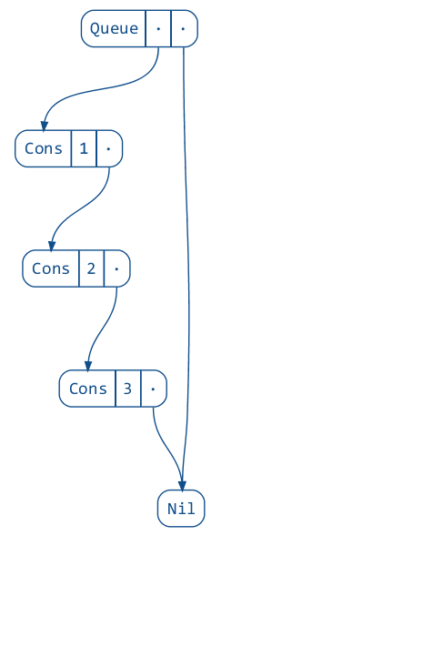</p>

### Features

* Pre-made visualizations of many standard collections.

<p align="center">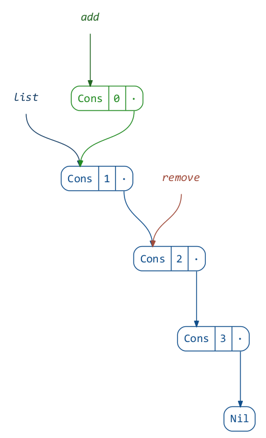</p>

* Automatic visualization of case classes (using
  [shapeless](https://github.com/milessabin/shapeless/wiki/Feature-overview:-shapeless-2.0.0#generic-representation-of-sealed-families-of-case-classes)).

```scala
case class Employee(
  name: String,
  salary: Long
)

case class Startup(
  name: String,
  founder: Employee,
  team: List[Employee]
)
```

<p align="center">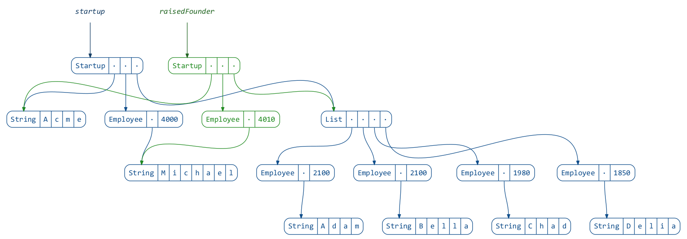</p>

* Static images as well as animations can be generated.
* Hassle-free captions (using [sourcecode](https://github.com/lihaoyi/sourcecode)).

### Getting Started

#### `RefTree`

This library renders diagrams based on a simple data representation called
[`RefTree`](https://github.com/stanch/reftree/blob/master/core/src/main/scala/reftree/core/RefTree.scala).
Essentially, a `RefTree` denotes either an object (`AnyRef`) with a number of fields,
or a primitive (`AnyVal`).

To render a value of type `A`, you will need an implicit instance of `ToRefTree[A]`.
For many Scala collections, as well as case classes, no extra work is needed,
as these instances are readily available or generated on the fly.

For examples of manual instance derivation, see the
[`contrib` package](https://github.com/stanch/reftree/tree/master/core/src/main/scala/reftree/contrib).

#### `Renderer`

To render diagrams and animations, you will need a `Renderer`:

```scala
import reftree.render._
import reftree.diagram._
import java.nio.file.Paths
import scala.collection.immutable.Queue

val renderer = Renderer(
  renderingOptions = RenderingOptions(density = 75),
  directory = Paths.get("images", "usage"),
  format = "png" // Or "svg", "ps" and others supported by dot
)
```

There are two ways to use it:

```scala
// using the `render` method
renderer.render("queue", Diagram(Queue(1)))

// using syntactic sugar
import renderer._
Diagram(Queue(1)).render("queue")
```

There are various rendering options you can set, for example:

```scala
// using the `render` method
renderer.tweakRendering(_.withVerticalSpacing(2)).render("queue", Diagram(Queue(1)))

// using syntactic sugar
Diagram(Queue(1)).render("queue", _.withVerticalSpacing(2))
```

#### `Diagram`

Diagrams can be created and combined into bigger diagrams using the following API:

```scala
// no caption
Diagram(Queue(1)).render("caption-none")
```

<p align="center">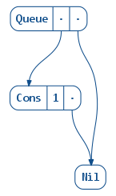</p>

```scala
// automatically set caption to "Queue(1) :+ 2"
Diagram.sourceCodeCaption(Queue(1) :+ 2).render("caption-source")
```

<p align="center">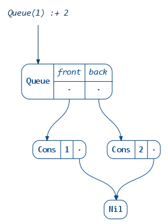</p>

```scala
// use toString to get the caption, i.e. "Queue(1, 2)"
Diagram.toStringCaption(Queue(1) :+ 2).render("caption-tostring")
```

<p align="center">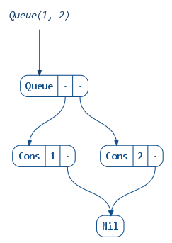</p>

```scala
// merge two diagrams, set captions manually
(Diagram(Queue(1)).withCaption("one") + Diagram(Queue(2)).withCaption("two")).render("one-two")
```

<p align="center">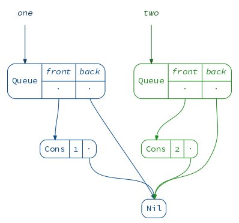</p>

```scala
// isolate each diagram in its own namespace (graph nodes will not be shared across them)
(Diagram(Queue(1)).toNamespace("one") + Diagram(Queue(2)).toNamespace("two")).render("namespaced")
```

<p align="center">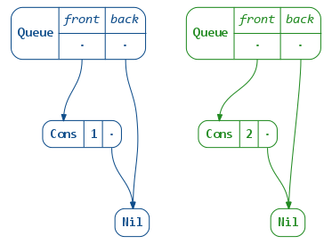</p>

#### `Animation`

Animation is essentially a sequence of diagrams, which can be rendered to an animated GIF.
The simplest way to create an animation is to use the builder API:

```scala
(Animation
  .startWith(Queue(1))
  .iterateWithIndex(2)((queue, i) ⇒ queue :+ (i + 1))
  .build()
  .render("animation-simple"))
```

<p align="center">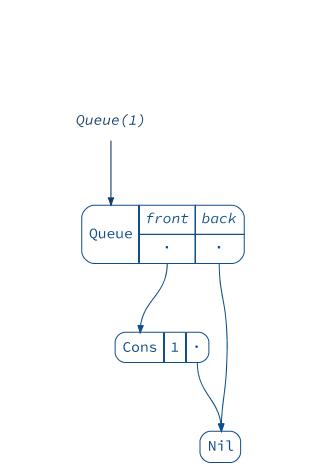</p>

You can also configure how the diagram for each frame is produced:

```scala
(Animation
  .startWith(Queue(1))
  .iterateWithIndex(2)((queue, i) ⇒ queue :+ (i + 1))
  .build(Diagram(_).withCaption("My Queue").withColor(2))
  .render("animation-captioned-red"))
```

<p align="center">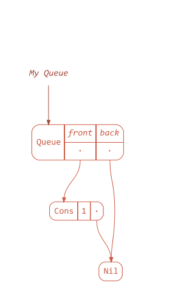</p>

Note that by default the library will try to reduce the average movement of
all tree nodes across animation frames. Sometimes you want to “anchor”
the root of the data structure instead, to force it to stay still
while everything else is moving. You can achieve this via `withAnchor` method:

```scala
(Animation
  .startWith(Queue(1))
  .iterateWithIndex(2)((queue, i) ⇒ queue :+ (i + 1))
  .build(Diagram(_).withAnchor("queue").withCaption("This node is anchored!"))
  .render("animation-anchored"))
```

<p align="center">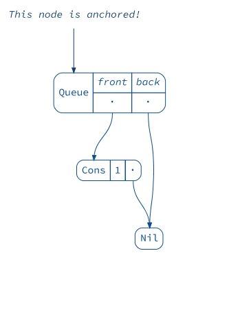</p>

Finally, animations can be combined in sequence or in parallel, for example:

```scala
val queue1 = (Animation
  .startWith(Queue(1))
  .iterateWithIndex(2)((queue, i) ⇒ queue :+ (i + 1))
  .build()
  .toNamespace("one"))

val queue2 = (Animation
  .startWith(Queue(10))
  .iterateWithIndex(2)((queue, i) ⇒ queue :+ (10 * (i + 1)))
  .build()
  .toNamespace("two"))

(queue1 + queue2).render("animation-parallel")
```

<p align="center">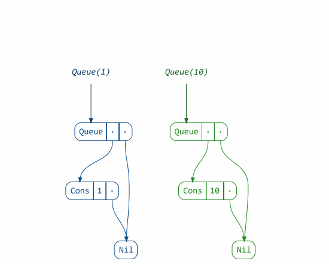</p>

See the [materials for my talk “Unzipping Immutability”](demo.md) for more inspiration!

### Usage

This project is intended for educational purposes and therefore is licensed under GPL 3.0.

To try it interactively:

```
$ sbt demo
@ render(List(1, 2, 3))
// display diagram.png with your favorite image viewer
```

You can depend on the library by adding these lines to your `build.sbt`
(the latest version can be found here:
[  ](https://bintray.com/stanch/maven/reftree/_latestVersion)):

```scala
resolvers ++= Seq(
  Resolver.bintrayRepo("stanch", "maven"),
  Resolver.bintrayRepo("drdozer", "maven")
)

libraryDependencies += "org.stanch" %% "reftree" % "latest-version"
```
