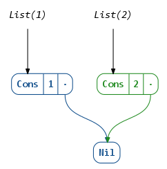
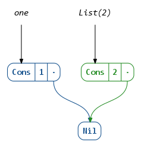
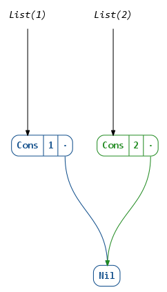
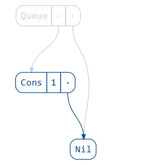
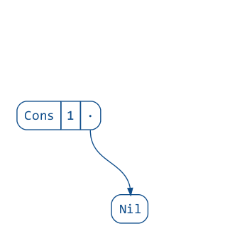
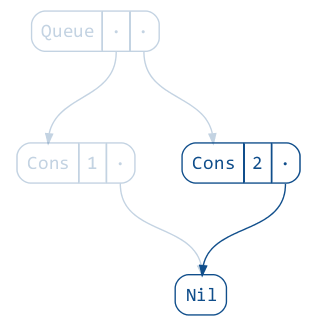
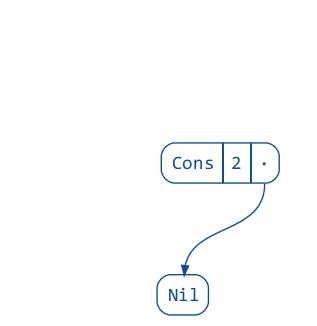
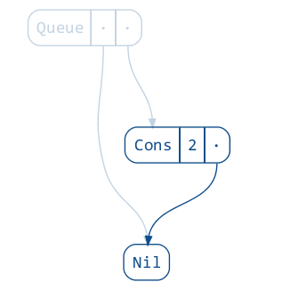
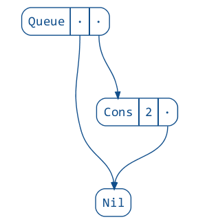
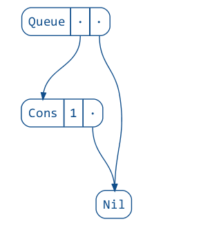

## reftree — automatic object tree diagrams for immutable data

[](https://gitter.im/stanch/reftree?utm_source=badge&utm_medium=badge&utm_campaign=pr-badge&utm_content=badge)

This project aims to provide visualizations for common functional data structures used in Scala.
The visualizations are generated automatically from code, which allows to use them in an interactive fashion.
To use this library you will need to have [GraphViz](http://www.graphviz.org/) installed (and have `dot` on your `PATH`).

For more examples see the [materials for my talk “Unzipping Immutability”](DEMO.md).

<p align="center"></p>

### Features

* Pre-made visualizations of many standard collections.

<p align="center"></p>

* Automatic visualization of case classes (using
  [shapeless](https://github.com/milessabin/shapeless/wiki/Feature-overview:-shapeless-2.0.0#generic-representation-of-sealed-families-of-case-classes)).

```scala
case class Employee(
  name: String,
  salary: Long
)

case class Startup(
  name: String,
  founder: Employee,
  team: List[Employee]
)
```

<p align="center"></p>

* Static images, animations and image sequences can be generated.
* Automatic captions (using [sourcecode](https://github.com/lihaoyi/sourcecode)).

### API

#### `RefTree`

This library renders diagrams based on a simple data representation called
[`RefTree`](https://github.com/stanch/reftree/blob/master/core/src/main/scala/reftree/RefTree.scala).
Essentially, a `RefTree` denotes either an object (`AnyRef`) with a number of fields,
or a primitive (`AnyVal`).

To render a value of type `A`, you will need an implicit instance of `ToRefTree[A]`
available. For many Scala collections, as well as case classes, no extra work is needed,
as these instances are readily available or generated on the fly.

For examples of manual instance derivation, see the
[`contrib` package](https://github.com/stanch/reftree/tree/master/core/src/main/scala/reftree/contrib).

#### `Diagram`

To render a diagram, first create a `Diagram` object that encapsulates some default settings:

```scala
import reftree._
import java.nio.file.Paths
import scala.collection.immutable.Queue

val diagram = Diagram(
  defaultOptions = Diagram.Options(density = 75),
  defaultDirectory = Paths.get("images", "usage")
)
```

Now you can use these methods to create diagrams:

```scala
// render to "structures.png", automatic captions
diagram.render("lists")(List(1), List(2))
```

<p align="center"></p>

```scala
// same as above, but with manually specified captions
diagram.render("lists-captioned")("one" → List(1), List(2))
```

<p align="center"></p>

```scala
// tweak the default options
diagram.render("lists-spaced", tweakOptions = _.copy(verticalSpacing = 2))(List(1), List(2))
```

<p align="center"></p>

```scala
// render a sequence of PNG images, i.e. "queue-01.png", "queue-02.png", etc
diagram.renderSequence("queue", tweakOptions = _.copy(interpolationFrames = 3))(
  Utils.iterate(Queue(1))(_ :+ 2, _.tail)
)
```

<p align="center">
  
  
  
  
  
  
  
  
  
</p>

```scala
// render an animated GIF
diagram.renderAnimation("queue")(Utils.iterate(Queue(1))(_ :+ 2))
```

<p align="center"></p>

See the [materials for my talk “Unzipping Immutability”](DEMO.md) for more ideas
of how the various options can be utilized.

### Usage

This project is intended for educational purposes and therefore is licensed under GPL 3.0.

To try it interactively:

```
$ sbt demo
@ render(List(1, 2, 3))
// display diagram.png with your favorite image viewer
```

You can depend on the library by adding these lines to your `build.sbt`
(the latest version can be found here:
[  ](https://bintray.com/stanch/maven/reftree/_latestVersion)):

```scala
resolvers ++= Seq(
  Resolver.bintrayRepo("stanch", "maven"),
  Resolver.bintrayRepo("drdozer", "maven")
)

libraryDependencies += "org.stanch" %% "reftree" % "latest-version"
```
