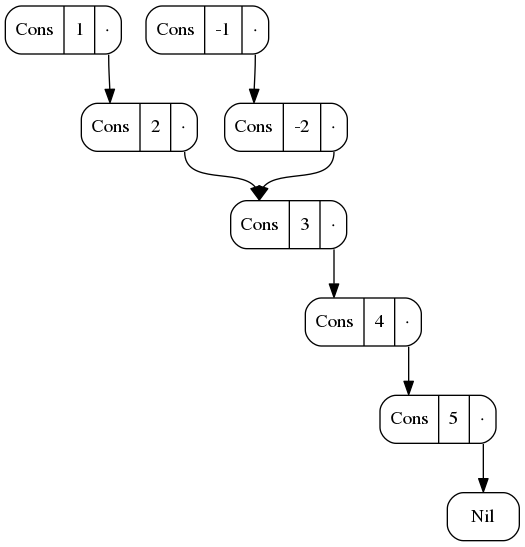
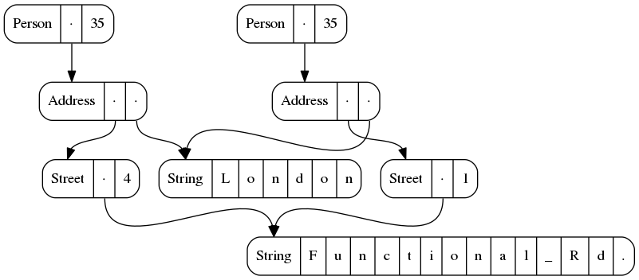

## Diapers — automatically generating DIAgrams of PERistent data Structures

This is work in progress.
The idea is to illustrate structural sharing in persistent data structures.

### Running

```shell
$ sbt run
```

### Examples

#### Lists

```scala
import diapers.AsData._
import diapers.DotPlotter

val list1 = List(1, 2, 3, 4, 5)
val list2 = List(-1, -2) ++ list1.drop(2)

DotPlotter.plot(
  list1.asData,
  list2.asData
)
```



#### Case classes

```scala
import diapers.AsData._
import diapers.DotPlotter
import com.softwaremill.quicklens._

case class Street(name: String, house: Int)
case class Address(street: Street, city: String)
case class Person(address: Address, age: Int)

val person1 = Person(Address(Street("Functional Rd.", 1), "London"), 35)
val person2 = person1.modify(_.address.street.house).using(_ + 3)

DotPlotter.plot(
  person1.asData,
  person2.asData
)
```


