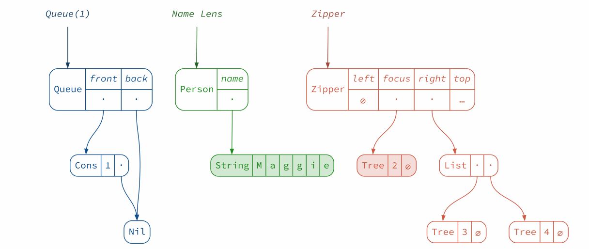

Behold, automatically generated diagrams and animations for your data!
`reftree` is a *Scala* and *Scala.js* library that allows you to
create data structure visualizations with very little effort.

There are a few ways you can use `reftree`:

* [improving the documentation of your projects](https://stanch.github.io/zipper/);
* [live-coding demos and talks](https://stanch.github.io/reftree/Talks.html);
* exploring how things work;
* anywhere you need diagrams of your Scala data structures.

Documentation, demos and more: https://stanch.github.io/reftree
