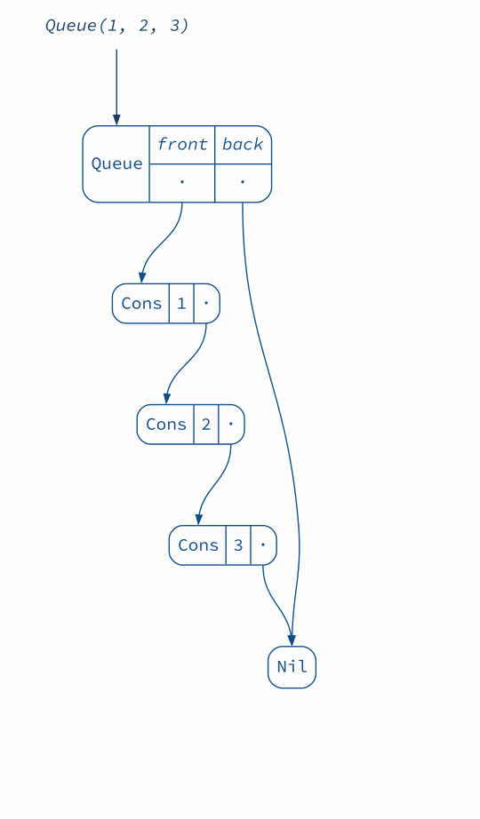
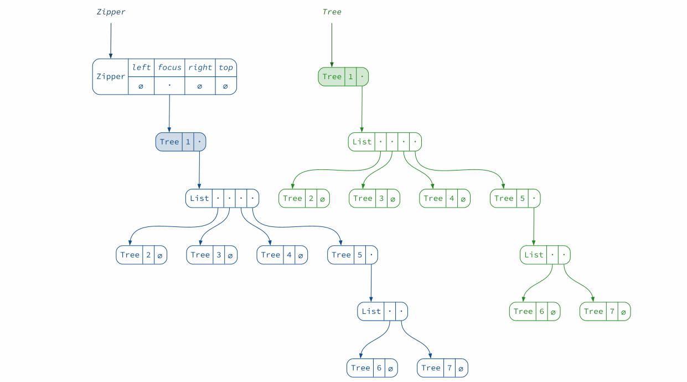

# Visualize your data structures!

This page contains the materials for my talk “Visualize your data structures!”.
Here are some past and future presentations:

* [ScalaDays Chicago, April 2017](http://event.scaladays.org/scaladays-chicago-2017#!#schedulePopupExtras-8067) ([video](https://www.youtube.com/watch?v=6mWaqGHeg3g)).
* [Scala Swarm, June 2017](http://scala-swarm.org/).

You can use this page in two ways:

* as a reference/refresher on the material covered in the talk;
* as an interactive playground where you can try the same commands I presented.

Here is an overview:

* [Introducing `reftree`](#introducing-reftree)
* [Inside `reftree`](#inside-reftree)
* [Functional animation](#functional-animation)
* [Zipping it up](#zipping-it-up)

Throughout this page we will assume the following
declarations (each section might add its own):

```mdoc:silent
import reftree.core._
import reftree.diagram._
import reftree.render._
import reftree.geometry._
import reftree.svg.animation.Frame
import reftree.svg.XmlSvgApi
import reftree.svg.XmlSvgApi.svgUnzip
import reftree.contrib.XmlInstances._
import reftree.contrib.OpticInstances._
import reftree.contrib.ZipperInstances._
import reftree.contrib.ShapelessInstances._
import reftree.util.Optics
import reftree.demo.Data
import reftree.demo.Shortcuts
import scala.collection.immutable._
import java.nio.file.Paths
import Diagram.{sourceCodeCaption => diagram}
```

To start an interactive session, just run

```
$ sbt demo
@ render(List(1, 2, 3))
```

and open `diagram.png` in your favorite image viewer (hopefully one that
reloads images automatically on file change). You will also need to have
[GraphViz](http://www.graphviz.org/) installed. *The interactive session
already has all the necessary imports in scope.*

## Introducing `reftree`

```mdoc:invisible
val ImagePath = "site/target/tut/images"
```

```mdoc:silent
// extra declarations for this section
val renderer = Renderer(
  renderingOptions = RenderingOptions(density = 75),
  directory = Paths.get(ImagePath, "visualize", "intro")
)
import renderer._
```

[reftree](https://stanch.github.io/reftree) is a library for visualizing Scala data structures.

Let’s look at a quick usage example:

```mdoc
case class Person(firstName: String, age: Int)

val bob = Person("Bob", 42)

diagram(bob).render("bob")
```


That’s it! You can configure the visualization as you like:

```mdoc
// render strings as a single box
import reftree.contrib.SimplifiedInstances.string

// rename the firstName field (pun not intended)
implicit val personConfig = (ToRefTree.DerivationConfig[Person]
  .tweakField("firstName", _.withName("name")))

diagram(bob).render("bob-simplified")
```


There are various ways you can use `reftree`:

* improving the documentation of your projects;
* live-coding demos;
* exploring how things work;
* anywhere you need diagrams of your Scala data structures.

(*Incidentally, this talk is an example of all of the above.*)

My previous `reftree`-powered [talk](Immutability.md) focused on
immutable data and various ways it can be manipulated (I do recommend it).

Today I would like to take you on a journey deep inside `reftree` itself,
so that we can see how some of these techniques and concepts can be applied...
to produce visualizations of themselves — using one of my favorite `reftree`
features: animations.

```scala
Animation
  .startWith(Queue(1, 2, 3))
  .repeat(3)(_.iterate(2)(q => q :+ (q.max + 1)).iterate(2)(_.tail))
  .build(Diagram.toStringCaption(_).withAnchor("queue"))
  .render("queue")
```



## Inside `reftree`

```mdoc:silent
// extra declarations for this section
import reftree.contrib.SimplifiedInstances.{option, seq, list}

val renderer = Renderer(
  renderingOptions = RenderingOptions(density = 75),
  directory = Paths.get(ImagePath, "visualize", "inside")
)
import renderer._
```

First, we need to grasp the basics of `reftree`.

To visualize a value of some type `A`, `reftree` converts it into a data structure
called `RefTree` (surprise!), using a typeclass `ToRefTree[A]`.

For case classes this is done automagically, using
[*shapeless*](https://github.com/milessabin/shapeless/wiki/Feature-overview:-shapeless-2.0.0#generic-representation-of-sealed-families-of-case-classes).
(*If you are curious about the magic, take a look at [this file](https://github.com/stanch/reftree/blob/master/core/shared/src/main/scala/reftree/core/GenericInstances.scala).*)
Given our friend `bob`, *shapeless* would provide a generic representation,
which includes the field names (at the type level!) and the values (as a heterogeneous list):

```mdoc
Shortcuts.generic(bob)

diagram(Shortcuts.generic(bob)).render("generic")
```


This information is enough to auto-generate a `RefTree`.
Now, what does it look like? The best way to find out is to visualize a `RefTree`
of a `RefTree`!

```mdoc
diagram(Shortcuts.refTree(bob)).render("reftree")
```


As you can see, it contains values (`Val`) and references (`Ref`).

How do we get from `RefTree` to an image though?
This is where [GraphViz](http://www.graphviz.org/) comes in.
From a `RefTree` we can obtain a graph definition that can be rendered by GraphViz:

```mdoc
Shortcuts.graph(bob).encode
```

Going even further, we can ask GraphViz for an [SVG](https://en.wikipedia.org/wiki/Scalable_Vector_Graphics) output:

```mdoc
Shortcuts.svg(bob)
```

At this point you might be guessing how we can use this as a basis for our animation approach.
Every state of a data structure will be a separate frame in the SVG format.
However, an animation consisting of these frames alone would be too jumpy.
We need to add intermediate frames to smoothly “morph” one frame into another.
With SVG being a vector format, this sounds simple.
We just have to individually morph different aspects of the image:

* graph node positions;
* graph edges and their shapes;
* colors;
* stroke thickness;
* transparency.

Ouch! A sane functional approach would definitely help here :)

## Functional animation

```mdoc:silent
// extra declarations for this section
val renderer = Renderer(
  renderingOptions = RenderingOptions(density = 75),
  directory = Paths.get(ImagePath, "visualize", "animation")
)
import renderer._
```

Let’s start by introducing an abstraction for morphing, or, in other words,
interpolating things of type `A`:

```scala
trait Interpolation[A] {
  def apply(left: A, right: A, time: Double): A
  def sample(left: A, right: A, n: Int, inclusive: Boolean = true): Seq[A]
}
```

(*If you are curious, [here is the actual implementation](https://github.com/stanch/reftree/blob/master/core/shared/src/main/scala/reftree/geometry/Interpolation.scala).*)

Once we have an instance of `Interpolation[xml.Node]`, we can generate
as many intermediate frames as we want! But how do we construct this instance?

Consider a lowly floating point number (it can represent an *x* coordinate of some element in our SVG, for example).
There is an obvious way to implement `Interpolation[Double]`, which `reftree` already defines as `Interpolation.double`:

```mdoc
val numbers = Interpolation.double.sample(0, 10, 5).toList

diagram(numbers).render("numbers")
```


Now if you think about a point in 2D space, it’s just two numbers joined together:

```mdoc
val point = Point(0, 10)

diagram(point).render("point")
```


Can we use the number interpolation to interpolate these two numbers?
To answer this question, let’s introduce more abstraction
(in a great tradition of functional programming).

A lens `Lens[A, B]` is something that can “focus” on a piece of data of type `B`
inside a data structure of type `A` and provide read-write access to it.
We will use the excellent [*Monocle* library](https://github.com/julien-truffaut/Monocle)
to create lenses and other optics along the way:

```mdoc
import monocle.macros.GenLens

val x = GenLens[Point](_.x)
val y = GenLens[Point](_.y)

(diagram(OpticFocus(x, point)).toNamespace("x") +
  diagram(OpticFocus(y, point)).toNamespace("y")).render("x+y")
```


Lenses provide several methods to manipulate data:

```mdoc
x.get(point)
y.set(20)(point)
y.modify(_ + 20)(point)
```

If we can read and write each coordinate field, we can interpolate them separately
and update the point field by field.
We do this by piping `Interpolation.double` through `x` and `y` lenses
and combining the resulting interpolations:

```mdoc
val pointInterpolation = (
  x.interpolateWith(Interpolation.double) +
  y.interpolateWith(Interpolation.double))

val points = pointInterpolation.sample(Point(0, 0), Point(10, 20), 5).toList

diagram(points).render("points")
```


Of course, `reftree` already defines this as `Point.interpolation`.

Using the same approach, we can build a polyline interpolator
(assuming the polylines being interpolated consist of equal number of points):

```mdoc
Data.polyline1
Data.polyline2

val polylineInterpolation = (GenLens[Polyline](_.points)
  .interpolateEachWith(Point.interpolation))

val polylines = polylineInterpolation.sample(Data.polyline1, Data.polyline2, 3).toList

diagram(polylines).render("polylines")
```


We are finally ready to implement our first substantial interpolator: one that morphs graph edges.
*The following approach is inspired by Mike Bostock’s [path tween](https://bl.ocks.org/mbostock/3916621),
however `reftree` puts more emphasis on types and even includes its own
[SVG path parser and simplification algorithm](https://github.com/stanch/reftree/blob/master/core/shared/src/main/scala/reftree/geometry/Path.scala).*

The resulting animation should look like this:


An edge is drawn with an [SVG path](https://developer.mozilla.org/en-US/docs/Web/SVG/Tutorial/Paths),
which consists of several commands, e.g. “move to”, “line to”, “bezier curve to”.
Here is a minimized SVG snippet for an actual edge:

```mdoc
Data.edge1

diagram(Data.edge1).render("edge")
```


As you can see, the commands themselves are given in the `d` attribute inside the `path` element
in a rather obscure format. Luckily, we have lenses and other optics at our disposal
to plumb through this mess.

First, let’s get to the `path` element. `reftree` implements a few things that will help us:
* `XmlSvgApi`, an implementation of several useful SVG operations for *scala-xml*.
  In particular, if offers a CSS selector-like method for matching elements of certain type and/or class.
* An optic that focuses on an element deep inside XML or any other recursive data structure: `Optics.collectFirst`.
  It is actually an `Optional`, not a `Lens`, since the element might be missing.

```mdoc
val edgePathElement = Optics.collectFirst(XmlSvgApi.select("path"))

diagram(OpticFocus(edgePathElement, Data.edge1)).render("edgePathElement")
```


Next, we need to “descend” to the `d` attribute. Here is where optics really shine:
we can compose `Optional[A, B]` with `Optional[B, C]` to get an `Optional[A, C]`:

```mdoc
val d = XmlSvgApi.attr("d")
val edgePathString = edgePathElement composeOptional d

diagram(OpticFocus(edgePathString, Data.edge1)).render("edgePathString")
```


Next, we will use an isomorphism, another kind of optic, to view
the string as a nice case class:

```mdoc
Path.stringIso

val edgePath = edgePathString composeIso Path.stringIso

diagram(edgePath.getOption(Data.edge1)).render("edgePath")
```


And finally, another isomorphism takes us from a `Path` to its sampled representation
as a `Polyline`. (*Purists will say that this is not really an isomorphism because
it’s not reversible, but with a lot of points you can get pretty close ;)*)

```mdoc
Path.polylineIso(points = 4)

def edgePolyline(points: Int) = edgePath composeIso Path.polylineIso(points)

diagram(edgePolyline(4).getOption(Data.edge1)).render("edgePolyline")
```


Let’s interpolate!

```mdoc
def edgeInterpolation(points: Int) = edgePolyline(points).interpolateWith(Polyline.interpolation)

def edges(points: Int, frames: Int) = (Data.edge1 +:
  edgeInterpolation(points).sample(Data.edge1, Data.edge2, frames, inclusive = false) :+
  Data.edge2)

AnimatedGifRenderer.renderFrames(
  edges(4, 4).map(Frame(_)),
  Paths.get(ImagePath, "visualize", "animation", "edges-4.gif"),
  RenderingOptions(density = 200),
  AnimationOptions(framesPerSecond = 1)
)

AnimatedGifRenderer.renderFrames(
  edges(100, 32).map(Frame(_)),
  Paths.get(ImagePath, "visualize", "animation", "edges-100.gif"),
  RenderingOptions(density = 200),
  AnimationOptions(framesPerSecond = 8)
)
```

With 4 points and 4 frames:


With 100 points and 32 frames:


*Interpolating the entire image is left as an exercise for the reader,
although the impatient will find the complete implementation
[here](https://github.com/stanch/reftree/blob/master/core/shared/src/main/scala/reftree/svg/animation/GraphInterpolation.scala).*

Notice that we never touched XML directly.
In fact, equipped with the same set of optics for another format or representation,
we would be able to operate on it without changing the code too much.
Case in point: `reftree` supports both
[*scala-xml*](https://github.com/stanch/reftree/blob/master/core/jvm/src/main/scala/reftree/svg/XmlSvgApi.scala) and
[*scala-js-dom*](https://github.com/stanch/reftree/blob/master/core/js/src/main/scala/reftree/svg/DomSvgApi.scala) (for Scala.js),
with only 50 lines of implementation-specific code for each backend.
This goes to show the flexibility and usefulness of optics.

## Zipping it up

```mdoc:silent
// extra declarations for this section
val renderer = Renderer(
  renderingOptions = RenderingOptions(density = 75),
  directory = Paths.get(ImagePath, "visualize", "zippers")
)
import renderer._
```

In the previous section we saw `Optics.collectFirst` — an optic that is able to perform
modifications deep inside SVG. How do we go about implementing something like this,
or, more generally, how do we edit recursive data structures such as XML?

This solution is called a “Zipper”, and was introduced by Gérard Huet in 1997.
It consists of a “cursor” pointing to a location anywhere in a tree — “current focus”.
The cursor can be moved freely with operations like `moveDownLeft`, `moveRight`, `moveUp`, etc.
Current focus can be updated, deleted, or new nodes can be inserted to its left or right.
Zippers are immutable, and every operation returns a new Zipper.
All the changes made to the tree can be committed, yielding a new modified version of the original tree.

My [zipper library](https://github.com/stanch/zipper#zipper--an-implementation-of-huets-zipper)
provides a few useful movements and operations. Just like optics, it’s rather generic and flexible.
The zipper can operate on any type, as long as an instance of the `Unzip` typeclass is available,
which can be automatically derived in many cases.
(*Note that the derivation of `Unzip` for SVG can be found
[here](https://github.com/stanch/reftree/blob/master/core/shared/src/main/scala/reftree/svg/api/BaseSvgApi.scala).*)

Consider a simple XML tree:

```mdoc
Data.simpleXml

diagram(Data.simpleXml).render("simpleXml")
```


When we wrap a Zipper around this tree, it does not look very interesting yet:

```mdoc
import zipper.Zipper

val zipper1 = Zipper(Data.simpleXml)

(diagram(Data.simpleXml) + diagram(zipper1)).render("zipper1")
```


We can see that it just points to the original tree.
In this case the focus is the root of the tree, which has no siblings,
and the parent zipper does not exist, since we are at the top level.

To move down the tree, we “unzip” it, separating the child nodes into
the focused node and its left and right siblings:

```mdoc
val zipper2 = zipper1.moveDownLeft

(diagram(zipper1) + diagram(zipper2)).render("zipper1+2")
```


The new Zipper links to the old one,
which will allow us to return to the root of the tree when we are done applying changes.
This link however prevents us from seeing the picture clearly.
Let’s look at the second zipper alone:

```mdoc
diagram(zipper2).render("zipper2b")
```


Great! We have `2` in focus and `3, 4, 5` as right siblings. What happens if we move right a bit?

```mdoc
val zipper3 = zipper2.moveRightBy(2)

diagram(zipper3).render("zipper3")
```


This is interesting! Notice that the left siblings are “inverted”.
This allows to move left and right in constant time, because the sibling
adjacent to the focus is always at the head of the list.

This also allows us to insert new siblings easily:

```mdoc
val zipper4 = zipper3.insertLeft(<fruit/>)

diagram(zipper4).render("zipper4")
```


And, as you might know, we can delete nodes and update the focus:

```mdoc
val zipper5 = zipper4.deleteAndMoveRight.set(<worm/>)

diagram(zipper5).render("zipper5")
```


Finally, when we move up, the siblings at the current level are “zipped”
together and their parent node is updated:

```mdoc
val zipper6 = zipper5.moveUp

diagram(zipper6).render("zipper6")
```


When we are done editing, the `.commit` shorthand can be used for going
all the way up (applying all the changes) and returning the focus.
Notice how all the unchanged nodes are shared between the old and the new XML.

```mdoc
val notSoSimpleXml = zipper6.commit

(diagram(Data.simpleXml) + diagram(notSoSimpleXml)).render("notSoSimpleXml")
```


*Using an XML zipper, a determined reader can easily implement advanced lenses,
such as `Optics.collectFirst`, `Optics.collectLeftByKey`, etc, all found
[here](https://github.com/stanch/reftree/blob/master/core/shared/src/main/scala/reftree/util/Optics.scala).*

To conclude, here is an animation of a zipper and the tree it operates on
(from my previous talk), produced (as we know now) not without zippers’ help:



That’s all! Thank you for reading this far.
I hope you are leaving this page with some great `reftree` use-cases in mind :)
